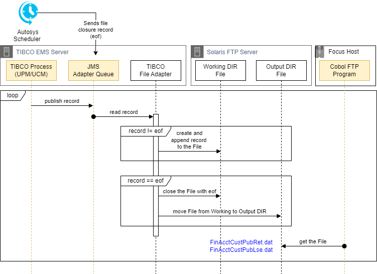
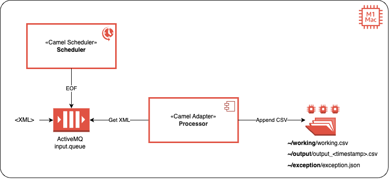
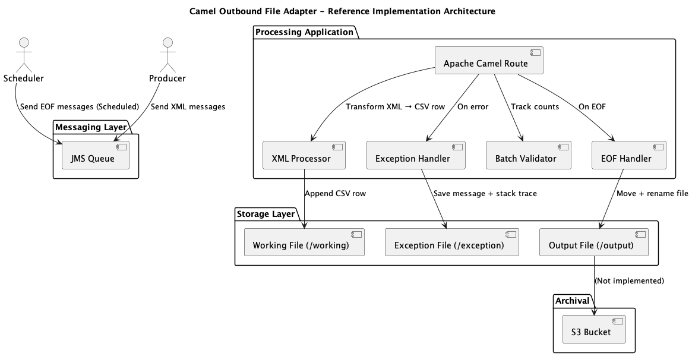
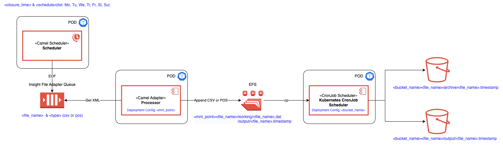
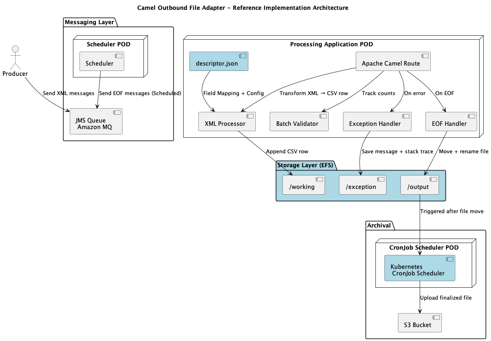
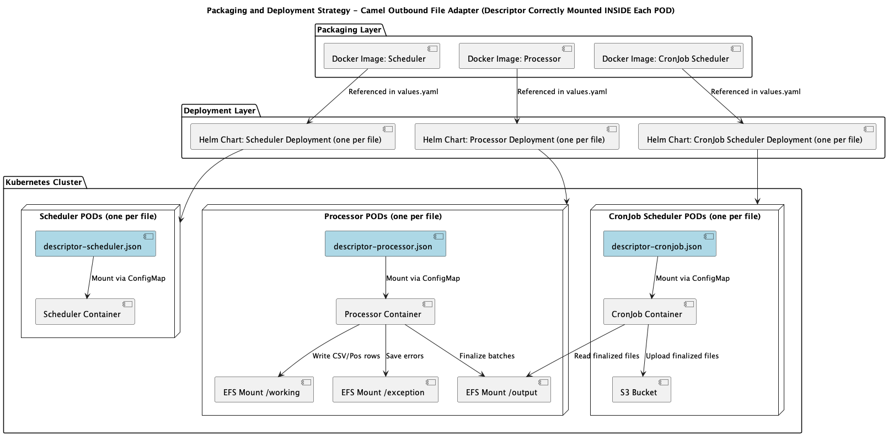
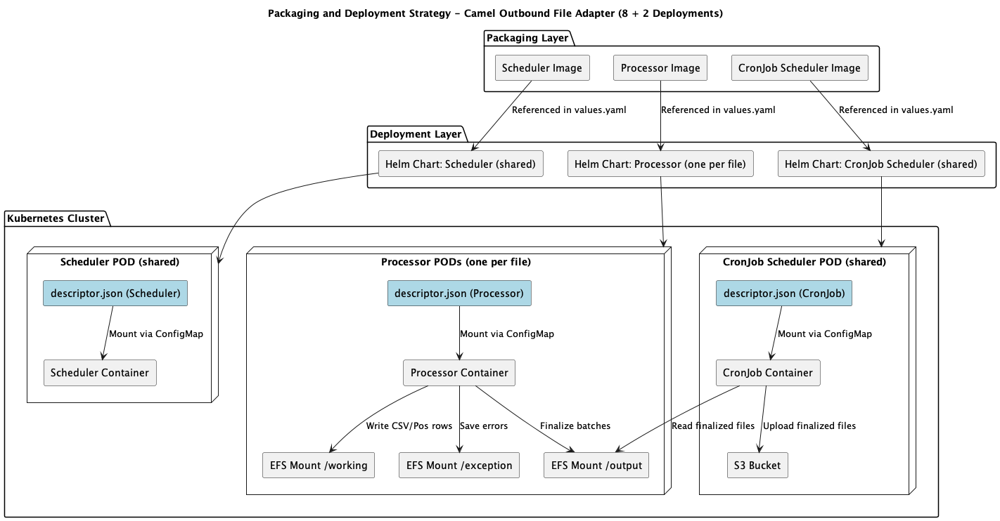

## Table of Contents

1. [Outbound File Adapter](#1-outbound-file-adapter)
2. [Problem Statement - Tibco Outbound File Adapter](#2-problem-statement---tibco-outbound-file-adapter)
   - [2.1 Adapter Architecture](#21-adapter-architecture)
   - [2.2 Adapter Files and EMS Queues](#22-adapter-files-and-ems-queues)
3. [Camel File Adapter – Reference Implementation](#3-camel-file-adapter---reference-implementation)
   - [3.1 Architecture](#31-architecture)
   - [3.2 Component Overview](#32-component-overview)
     - [3.2.1 Scheduler](#321-scheduler)
     - [3.2.2 Processor](#322-processor)
       - [3.2.2.1 Messaging Layer](#3221-messaging-layer)
       - [3.2.2.2 Processing Application (Single Local Processor)](#3222-processing-application-single-local-processor)
       - [3.2.2.3Storage Layer (Local File System)](#3223storage-layer-local-file-system)
       - [3.2.2.4 Archival](#3224-archival)
4. [Deploying Reference Implementation to Production](#4-deploying-reference-implementation-to-production)
   - [4.1 Architecture](#41-architecture)
   - [4.2 Changes](#42-changes)
     - [4.2.1 Updates to Scheduler (Camel Scheduler POD)](#421-updates-to-scheduler-camel-scheduler-pod)
     - [4.2.2 Changes to Processor (Camel Processor POD)](#422-changes-to-processor-camel-processor-pod)
     - [4.2.3 EFS Configuration (Shared Storage Layer)](#423-efs-configuration-shared-storage-layer)
     - [4.2.4 Changes to Kubernetes `CronJob Scheduler`](#424-changes-to-kubernetes-cronjob-scheduler)
   - [4.3 Packaging and Deployment](#43-packaging-and-deployment)
     - [4.3.1 Deployment Strategies: 8×3 Model (Per-File Per-Component Deployment)](#431-deployment-strategies-8×3-model-per-file-per-component-deployment)
     - [4.3.2 Deployment Optimization: Shared Scheduler and CronJob (8+2 Model)](#432-deployment-optimization-shared-scheduler-and-cronjob-82-model)

# 1. Outbound File Adapter 

This document consolidates the design and evolution of the Outbound File Adapter replacement initiative. It introduces the current Tibco outbound file adapter solution, outlines the reference implementation based on Apache Camel, and documents the final production-grade implementation, highlighting the necessary architectural and deployment changes.

**Repository References**

The design and implementation details of the Camel Outbound Adapter are documented across the following repositories:

---
| Repository           | Description                                               | Status         |
|----------------------|-----------------------------------------------------------|----------------|
| outbound-adapter     | Main entry point that orchestrates all outbound flow.     | 🟢 Start here   |
| outbound-requirements| Functional and technical requirements documentation.      | 📄 Requirements |
| outbound-scheduler   | Publishes EOF signals to trigger batch finalization.      | ⏰ Scheduler    |
| outbound-processor   | Transforms and writes JMS messages to files.              | 🛠️ Processor    |
---
**Tip:** Use this table from any repo to find your way back to the main flow or explore related modules.

# 2. Problem Statement - Tibco Outbound File Adapter

## 2.1 Adapter Architecture

The existing Tibco Outbound File Adapter architecture is depicted in the following figure.

*Figure 1: Tibco Outbound File Adapter*

The Tibco Outbound File Adapter implements a structured batching process, summarized in the following key steps:

1. **Message Publishing:**
Tibco source processes (UPM/UCM) transform business records into XML format and publish them to the JMS Adapter Queue.
2. **File Writing:**
The Tibco File Adapter continuously listens to the JMS Adapter Queue, reads the incoming XML records, transforms them into positional or delimited format, and appends them sequentially to a working file in the Solaris Working Directory.
3. **Batch Closure:**
Based on a predefined schedule, the Tibco Scheduler publishes a special EOF (End-of-File) record to the JMS Adapter Queue. Upon encountering the EOF, the File Adapter finalizes the working file by closing it properly for writing.
4. **File Movement and Archival:**
After closing the file, the File Adapter’s post-processing script moves the finalized file from the Working Directory to the Output Directory without altering the filename. Simultaneously, a copy of the finalized file is archived with a timestamp appended to its name for historical record-keeping.
5. **Continuation:**
Once the move and archival are complete, the File Adapter initializes a new working file in the Solaris Working Directory, ready to receive the next batch of incoming records. This process then continues cyclically.

## 2.2 Adapter Files and EMS Queues

The following tables document the batch files processed by the Tibco EMS File Adapter, including their sources, targets, file types, and additional relevant information.

---
| Interface Name                | Source | Target       | File Type  | File Name         | Type     | Count |
|-------------------------------|--------|--------------|------------|--------------------|----------|-------|
| Demographic Publish - Contact | UPM    | HOST/Insight | Positional | FinAcctCustPubLse.dat   FinAcctCustPubRet.dat   UCM_InSight_CustUpdate.txt    | Outbound | TBD      |
| Demographic Publish - Account | UPM    | HOST/Insight | Positional | FinAcctCustPubLse.dat  FinAcctCustPubRet.dat; UCM_InSight_CustUpdate.txt     | Outbound |    TBD   |
| Privacy Publish - Lease       | UPM    | HOST/Insight | Positional | ooacctl.dat   UCM_InSight_Priv.txt                                                        | Outbound |   TBD    |
| Privacy Publish - Retail      | UPM    | HOST/Insight | Positional | ooacctr.dat   UCM_InSight_Priv.txt                                                        | Outbound |   TBD    |
| Insight Comments              | SFDC   | Insight      | Delimited  | T_SIEBEL_NOTES.dat      | Outbound |   TBD    |
| Click 2 Dial Comments         | SFDC   | Insight      | Delimited  | SF_ClickToDial_INS_COMMENTS.dat | Outbound |   TBD    |
---
*Table - Batch Interfaces*

**Note:** There are eight distinct files involved, summarized below along with their corresponding Tibco EMS Queue Names.

---
| #  | File Name                        | File Adapter Queue Name                           |
|----|----------------------------------|---------------------------------------------------|
| 1  | FinAcctCustPubLse.dat           | TFS.CLM.FCS.CUSTPUBLSE.V1_0.IN                    |
| 2  | FinAcctCustPubRet.dat           | TFS.CLM.FCS.CUSTPUBRET.V1_0.IN                    |
| 3  | UCM_InSight_CustUpdate.txt      | TFS.CLM.INST.CUSTOMER_PUBLISH.V1_0.IN            |
| 4  | ooacctl.dat                     | TFS.CLM.FCS.FINACCTPRIVACYUPDATESRETL.V1_0.IN    |
| 5  | UCM_InSight_Priv.txt            | TFS.CLM.INST.PRIVACY_UPDATES.V1_0.IN             |
| 6  | ooacctr.dat                     | TFS.CLM.FCS.FINACCTPRIVACYUPDATESRETL.V1_0.IN    |
| 7  | T_SIEBEL_NOTES.dat              | TFS.CRM.DWH.INST_COMMENTS.V1_0.IN                |
| 8  | SF_ClickToDial_INS_COMMENTS.dat | TFS.CRM.DWH.INST_CLICK2DIAL_COMMENTS.V1_0.IN     |
---
*Table: Files and Tibco EMS Queues*

# 3. Camel File Adapter - Reference Implementation

## 3.1 Architecture

This section presents the design and implementation of a **Spring Boot + Apache Camel** application that ingests messages from a JMS queue, transforms them into CSV format, and writes them to a file.

The reference implementation is designed to replace the legacy **Tibco Outbound File Adapter** by ensuring that all critical requirements are met, including:

 - Transactional safety
 - Ordered record writing
 - Batch closure upon EOF
 - Exception handling
 - Restartable operation
 - Count validation for message integrity

The reference implementation leverages **locally installed components**, including an embedded ActiveMQ broker and a local file system folder structure, as depicted in the following figure.

 *Figure: Camel Outbound File Adapter – Reference Implementation*

Apache Camel orchestrates routing, transformation, and fault tolerance, while Spring Boot provides the runtime infrastructure and configuration management.

## 3.2 Component Overview

The Camel reference implementation replicates and enhances the Tibco Adapter's key responsibilities through two primary components: `Scheduler` and `Processor`.

### 3.2.1 Scheduler

The `EofPublisherRoute` component is a Camel route that uses the Apache Camel **Timer component** to periodically (hardcoded - every 60 seconds) generate and publish an `EOF` (End-of-File) XML marker to the `input.queue` on `ActiveMQ,` signaling the batch closure event for downstream processing.

### 3.2.2 Processor

The Reference Implementation consolidates all processing into a **single application deployed on a local machine**. It replaces the Tibco File Adapter by handling message transformation, batching, validation, and error logging using a Spring Boot and Apache Camel application.

 *Figure: Camel Outbound File Adapter Architecture*

The following section offers a brief overview of the components; refer to the associated repositories for detailed implementation information.

#### 3.2.2.1 Messaging Layer

 - **JMS Queue:** Acts as the inbound message buffer.

    - **Producer** sends regular XML messages to the queue.
    - **Scheduler** sends scheduled EOF (End-of-File) markers to the same queue to trigger batch finalization.

#### 3.2.2.2 Processing Application (Single Local Processor)

 - **Apache Camel Route:** Orchestrates the end-to-end flow, coordinating message transformation, validation, error handling, and batch rotation.

 - **XML Processor:** Transforms incoming XML messages into CSV rows according to a predefined mapping.
 - **Exception Handler:** Captures transformation or processing failures and logs the original message along with the stack trace into a structured JSON file.
 - **Batch Validator:** Tracks the number of successfully processed messages, ensuring message integrity by comparing counts at EOF.
 - **EOF Handler:** Detects EOF signals, closes the current working file, moves it to the output directory with a timestamped name, and triggers final validation.

#### 3.2.2.3Storage Layer (Local File System)

 - **Working File** (`/working`): Open file where transformed CSV rows are appended during batch processing.
 - **Exception File** (`/exception`): Directory where failed messages and error details are stored.
 - **Output File** (`/output`): Directory where finalized, timestamped batch files are moved after successful batch closure.

#### 3.2.2.4 Archival

 - S3 Bucket (Planned, Not Implemented in the Reference Implementation):  
Placeholder for future functionality where finalized output files will be uploaded to Amazon S3.

# 4 Deploying Reference Implementation to Production

## 4.1 Architecture

The Camel Outbound File Adapter reference implementation, illustrated in the reference architecture figures, demonstrates transactional batching of JMS messages into files using a single, local application instance. Building on this foundation, the production deployment — depicted in the production architecture figures — **adopts a one-pipeline-per-file model** across Kubernetes PODs, while preserving key design principles such as transactional safety, batch integrity, and single-POD Processor deployment for message order. 

 *Figure: Production Camel Outbound Adapter Architecture (High-Level View)

 *Figure: Production Camel Outbound Adapter Architecture (Component View)*

The following sections outline the detailed changes required across `Scheduler`, `Processor`, `EFS Storage`, C`ronJob Scheduler`, and Deployment Strategies to achieve this production-ready architecture.

## 4.2 Changes

### 4.2.1 Updates to Scheduler (Camel Scheduler POD)
---
| Area                  | Changes |
|------------------------|---------|
| Timer Configuration    | Replace the hardcoded 60-second Camel Timer with a descriptor-based configuration (`closure_time` and `schedule`). Scheduler must be configurable for different files and run times. |
| Runtime Trigger        | Scheduler should trigger EOF based on day/time (cron) expressions rather than simple timer intervals. |
| Dynamic Configuration  | Each Scheduler deployment reads its file-specific `descriptor.json`, specifying `<closure_time>` and `<schedule>` parameters. |
| Deployment             | Separate Scheduler POD for each batch file, parameterized by file-specific schedule. |
---

  

### 4.2.2 Changes to Processor (Camel Processor POD)

---
| Area                  | Changes |
|------------------------|---------|
| File Destination       | Replace local Mac folders with Amazon EFS mounts in Kubernetes. Processor writes directly into mounted EFS under `/working`, `/output`, and `/exception` directories. |
| Descriptor Usage       | Processor must dynamically load the `descriptor.json` at runtime, specifying `<mnt_point>`, `<file_name>`, and `<type>` (csv or positional). |
| Error Handling         | Structured error files must be written to `/exception` on EFS, and a retry or manual intervention process must be defined for failed messages. |
| Transactionality       | Processor must ensure EFS writes are atomic and durable across potential pod restarts (POSIX EFS compliance guarantees atomic renames). |
| Deployment             | Each batch file will have a dedicated Processor POD, separately deployed but using the same code base. |
| Scaling Strategy       | Single-threaded per file instance (one active Processor per file), allowing safe parallelism across different files. |
---

 

### 4.2.3 EFS Configuration (Shared Storage Layer)

---
| Area                  | Changes |
|------------------------|---------|
| File Organization      | Create a dedicated folder structure for each file under a shared EFS mount: `<mnt_point>/working`, `<mnt_point>/output`, and `<mnt_point>/exception`. |
| Access Control         | Use Kubernetes PersistentVolume (PV) and PersistentVolumeClaim (PVC) mapped to the same EFS filesystem, but different `subPath`s for each Processor. |
| State Persistence      | Because EFS persists across pod restarts, no extra local backup is needed for crash recovery. Interrupted files remain intact in `/working`. |
| Performance Considerations | Enable EFS Performance Mode as “MaxIO” if high concurrency is expected across multiple files. |
---

 

### 4.2.4 Changes to  Kubernetes `CronJob Scheduler`

---
| Area                  | Changes |
|------------------------|---------|
| Triggering             | Create a Kubernetes CronJob that triggers shortly after the expected EOF and file rotation (e.g., if EOF is at 4:00 PM, trigger CronJob at 4:10 PM). |
| Configurable Schedules | Each CronJob should use a deployment-specific `descriptor.json` containing `<bucket_name>` and `<cronjob_run_time>`. |
| File Upload            | CronJob POD mounts the EFS `/output` directory and uploads finalized files to S3. |
| Archival Structure     | Files are uploaded into two S3 paths per file: `/archive/` and `/output/` subfolders under the bucket name. |
| Deployment             | Deploy one CronJob Scheduler POD per file, each independently uploading based on its configured schedule and bucket settings. |
---

## 4.3 Packaging and Deployment
 This section outlines the packaging and deployment strategy for the Camel Outbound File Adapter, transitioning from a reference implementation to a scalable, production-ready Kubernetes architecture. Each core component — `Scheduler`, `Processor`, and `CronJob Scheduler` — is packaged as a separate Docker image and deployed independently using Helm charts. 

### 4.3.1 Deployment Strategies: 8×3 Model (Per-File Per-Component Deployment)

The **8×3 model** represents a fully decoupled deployment approach where each file-specific pipeline includes its dedicated `Scheduler`, `Processor`, and `CronJob Scheduler` components. This results in a total of **24 deployments** (8 files × 3 components), each operating independently. 

 Figure: 8x3 Model Deployment Stratrgy 

 

**Deployment Strategies (8 x 3 Model)**

---
| Area                  | Changes |
|------------------------|---------|
| Per-File Pipelines     | Deploy each `Scheduler`, `Processor`, and `CronJob Scheduler` separately per file (total of 3 POD types × number of files). |
| Runtime Parameterization | Use Kubernetes `ConfigMaps` or Secrets to inject `descriptor.json` per deployment, avoiding hardcoding. |
| Docker Image Reuse     | Use a single, shared Docker image per component (`Scheduler`, `Processor`, `CronJob`), configured at runtime via `descriptor.json`. |
| Helm Charts            | Recommended: Package each component into Helm charts for easy per-file deployment and upgrade management. |
| Monitoring and Logging | Implement pod-level logging to capture errors, EOF markers, processing counts, and upload success/failures. |
| Health Checks          | Add `liveness` and `readiness` probes for each component to ensure they can restart cleanly and report health. |
---

While this model offers maximum runtime isolation, parallelism, and simplified traceability per file, it introduces additional overhead in deployment management, monitoring, and resource allocation. The approach is suitable for environments that prioritize strict functional separation, independent scaling, and granular fault recovery across file-specific workflows.

### 4.3.2 Deployment Optimization: Shared Scheduler and CronJob (8+2 Model)

This architecture introduces a shared deployment model that consolidates the Scheduler and CronJob Scheduler components to reduce deployment complexity and improve operational efficiency. 

 Figure: 8+2 Model Deployment Stratrgy 

Instead of deploying one instance per file, the system uses **a single shared `Scheduler`** to publish EOF signals for all batch files and **a single shared `CronJob Scheduler`** to upload finalized files from all output folders to Amazon S3. This reduces the total number of Kubernetes deployments from 24 (3 components × 8 files) to just **10 deployments** — 8 dedicated Processor PODs (one per file) and 2 shared control components. Each POD still mounts its file-specific descriptor.json to ensure clear separation of responsibilities, and the shared components are enhanced to dynamically read and process configurations for all file pipelines. This model preserves the single-threaded processing requirement for each file while simplifying lifecycle management, scaling, and observability.

 

**Deployment Strategies (8 + 2 Model)**

---
| Area                  | Changes (8+2 Deployment Model) |
|------------------------|--------------------------------|
| Per-File Pipelines     | Deploy only the `Processor` POD separately per file (8 total). Use one shared `Scheduler` and one shared `CronJob Scheduler` POD across all files. |
| Runtime Parameterization | Use Kubernetes `ConfigMaps `to inject `descriptor.json` into each POD, allowing each to read file-specific configuration at runtime. |
| Docker Image Reuse     | Use one shared Docker image per component (`Scheduler`, `Processor`, `CronJob`) across all deployments, configured at runtime via `descriptor.json`. |
| Helm Charts            | Use three Helm charts (one per component). Each chart supports multiple instances using templated values and overrides. |
| Monitoring and Logging | Centralize logging with file tags. Track EOF signals, transformation counts, and upload outcomes across all file pipelines. |
| Health Checks          | Add liveness and readiness probes to each component POD to detect faults and enable automated restarts if necessary. |
---
