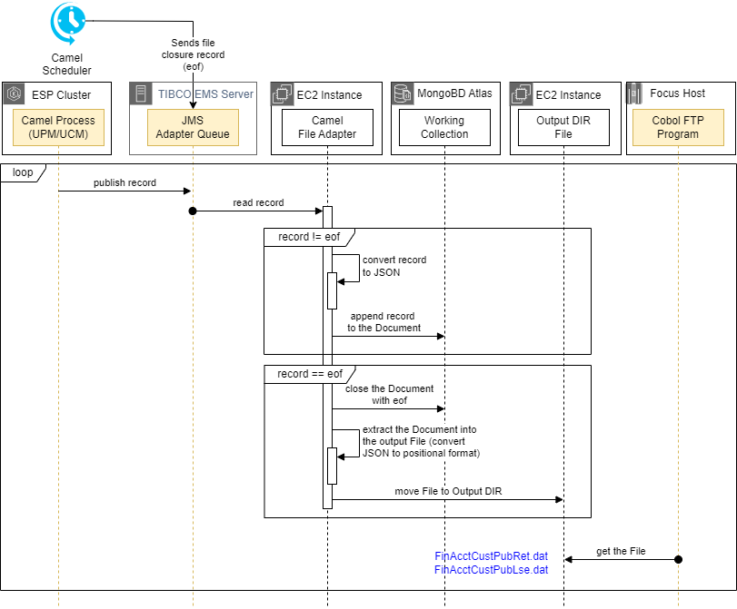
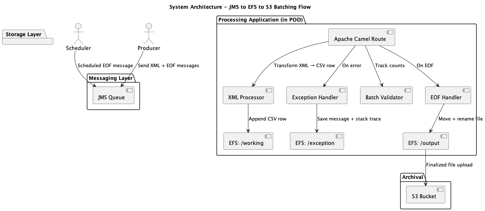

# Design and Implementation Overview: Batching JMS Messages to Files

## 🧭 Project Navigation Legend

This table provides a quick reference across all repositories in the outbound messaging solution. Use it to understand each component’s role and navigate between them easily.

| Repository            | Description                                  | Status             |
|-----------------------|----------------------------------------------|--------------------|
| [outbound-adapter](https://github.com/sipcic/outbound-adapter)           | Main entry point that orchestrates all outbound flow. | 🟢 **You are here**  |
| [outbound-requirements](https://github.com/sipcic/outbound-requirements) | Functional and technical requirements documentation. | 📄 Requirements         |
| [outbound-scheduler](https://github.com/sipcic/outbound-scheduler)       | Publishes EOF signals to trigger batch finalization. | ⏰ Scheduler         |
| [outbound-processor](https://github.com/sipcic/outbound-processor)       | Transforms and writes JMS messages to files.         | 🛠️ Processor  |

> 🔗 **Tip**: Use this table from any repo to find your way back to the main flow or explore related modules.

---

## Problem Statement - Tibco Outbound File Adapter

The following Figure depicts the current Outbound Direct FTP file processing pattern.



The processing steps include:

1. The Tibco source process transforms JMS XML records to target XML and publishes them to the JMS Adapter Queue.

2. The Tibco File Adapter continuously reads the records, transforms them to positional format, and appends them to the File in the Solaris Working DIR.

4. The File Adapter preserves the sequence of records from the Adapter Queue.
Based on the predefined schedule, the Tibco Scheduler publishes the EOF record to the JMS Adapter Queue.

5. Once the Adapter encounters the EOF record, it closes the File for writing.

6. The Adapter's postprocessing script moves the File to the Solaris Output Directory, maintaining the File name.

7. The Adapter's script also copies the File to the Archive Directory with the date timestamp appended.

8. Upon the completion of the move, the Adapter opens the new instance of the File in the Working Directory, and the process repeats.

## Camel Outbound Adapeter - High-Level Overview

This document outlines the design and implementation approach for a batch processing system that ingests JMS messages, transforms them into CSV records, writes them to a file on a shared NFS mount, and transfers the finalized batch to an S3 bucket. The architecture ensures message order, transactional integrity, and seamless batch rotation using EOF signaling.



## Message Ingestion

The application continuously listens to a JMS queue for incoming XML messages. These messages are assumed to follow a flat schema defined by the external `descriptor.json` file. Each message is processed within a transactional Camel route, ensuring that:

- The message is acknowledged **only after** successful transformation and persistence.
- Errors during transformation are captured and logged in a structured exception file.

## Batching and EOF Handling

The system operates in a rolling batching mode, where messages are streamed into an appendable file until an EOF (end-of-file) signal is received. The EOF message is a special JMS message with a flag indicating that the current batch should be finalized.

A **scheduler** is responsible for publishing EOF messages at a regular interval (e.g., once per day or after N messages). This ensures that batching is time- or size-bound.

Upon receiving an EOF:
- The working file is closed.
- A timestamp is appended to the filename.
- The file is moved from the `working/` directory to the `output/` directory on the same NFS mount.

## Use of NFS Shared Folders

Amazon EFS (or another NFS-compatible shared volume) is used to persist intermediate and final output:

- `/working` — location where `working.csv` is incrementally appended to.
- `/output` — finalized files are moved here after EOF is processed.
- `/exception` — if a message cannot be processed, the original message and stack trace are written as a JSON file to this directory.

This use of NFS allows for:
- Stateful recovery across restarts.
- External access to files for reconciliation or monitoring.
- Multi-pod support if scaled horizontally.

## Copying Final Output to S3

After a batch is rotated (i.e., EOF processed and file moved to `/output`), a secondary step copies the finalized CSV file to an S3 bucket for archival, downstream analytics, or data lake ingestion.

This transfer is performed using the AWS SDK or CLI:
```bash
aws s3 cp /output/output_20240421T235500.csv s3://my-bucket/batches/
```
Or programmatically using:
```java
s3Client.putObject(PutObjectRequest.builder()
    .bucket("my-bucket")
    .key("batches/output_20240421T235500.csv")
    .build(),
    RequestBody.fromFile(Paths.get("/output/output_20240421T235500.csv")));
```

Once copied, the original file may be:
- Retained in EFS for N days.
- Automatically cleaned up via a lifecycle policy.

## Why Use EFS Instead of S3 for Working and Output Files

While Amazon S3 is ideal for durable storage and downstream analytics, **Amazon EFS is better suited for active batching workflows** due to its file-system semantics and real-time write performance.

### EFS vs. S3: Practical Comparison

| Feature                        | Amazon EFS ✅        | Amazon S3 ❌                         |
|-------------------------------|----------------------|-------------------------------------|
| Append to existing file       | ✅ Supported          | ❌ Not supported (requires full object rewrite) |
| File rename/move operations   | ✅ Native POSIX       | ❌ Requires copy/delete logic       |
| Low-latency small writes      | ✅ Millisecond-scale  | ❌ Higher latency (upload-based)    |
| Real-time visibility          | ✅ Immediate          | ❌ Not available until upload completes |
| Seamless Camel integration    | ✅ No code changes    | ❌ Requires S3 SDK or Camel AWS component |
| Shared access (multi-pod/MFT) | ✅ Supported          | 🔄 Requires API-based access or S3 mounting tools |

### Why EFS Is Used in This Architecture

- **Incremental Batching:** Allows appending each message as a CSV row without re-uploading files.
- **Stateful Recovery:** Files remain accessible after crashes or restarts.
- **Tool Compatibility:** External tools (e.g., MFT) can access files directly via NFS.
- **Simplified Logic:** Works with Camel’s native file component, no need for S3-aware routing.

> ✅ **EFS is used for real-time batching**, while **S3 is reserved for finalized file archival**.

## 📚 Documentation References

The following resources provide detailed design and implementation documentation for key components of the system:

- **Requirements Document**  
  [View Requirements](https://github.com/sipcic/outbound-requirements)  
  Describes functional and non-functional requirements, system behavior, and message formats.

- **Camel Scheduler (EOF Publisher)**  
  [View Camel Scheduler](https://github.com/sipcic/outbound-scheduler)  
  Explains the scheduled route responsible for publishing EOF messages to the JMS queue at defined intervals.

- **Camel Outbound Adapter**  
  [View Camel Outbound Adapter](../https://github.com/sipcic/outbound-processor)  
  Describes the Apache Camel route and logic that consumes messages from the JMS queue, performs transformation, batching, rotation, and uploads completed batches to Amazon S3.
  
  ## Additional Features

- **Validation:** Message counters verify that the number of received XML messages matches the number of written CSV records.
- **Exception Handling:** Any processing error results in a structured error file saved in `/exception/`.
- **Configurability:** Field mappings, delimiter, and paths are externalized via `descriptor.json` and application properties.

## Summary

This design ensures scalable, fault-tolerant, and traceable batching of JMS messages using Apache Camel, NFS for intermediate file handling, and S3 for durable, long-term storage. It balances performance (via NFS) with cloud-native extensibility (via S3).

